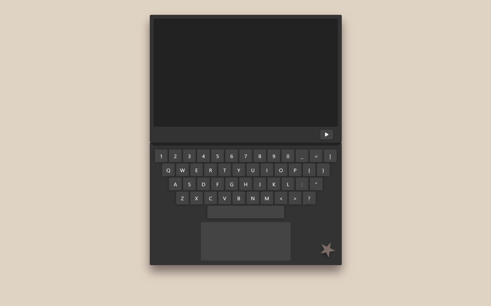

# Message

Une page simple en HTML, CSS, Javascript permettant de naviguer sur un ordinateur pour afficher un message secret.

## Fonctionnalités

- **Naviguer sur l'ordinateur**
- **Voir un message**

## Technologies utilisées

- **HTML** : Structure de la page
- **CSS** : Design et mise en forme
- **JavaScript** : Logique de la page

## Utilisation

1. Allumer l'ordinateur
2. Ouvrez le message
3. Éteignez l'ordinateur

L'image "[logo.png](https://pixabay.com/fr/vectors/star-favori-signet-blanche-156057 "hyperlien vers le logo étoile.")" vient de la banque d'image gratuite Pixabay, recommandé par le site du gouvernement, [Gouv.fr](https://fse.gouv.fr/les-banques-dimages "hyperlien vers le site du gouvernement").
